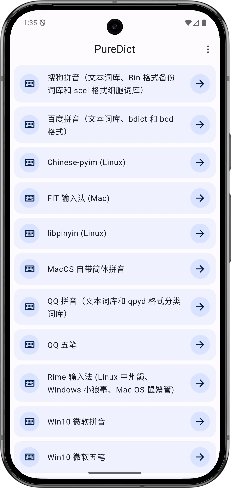
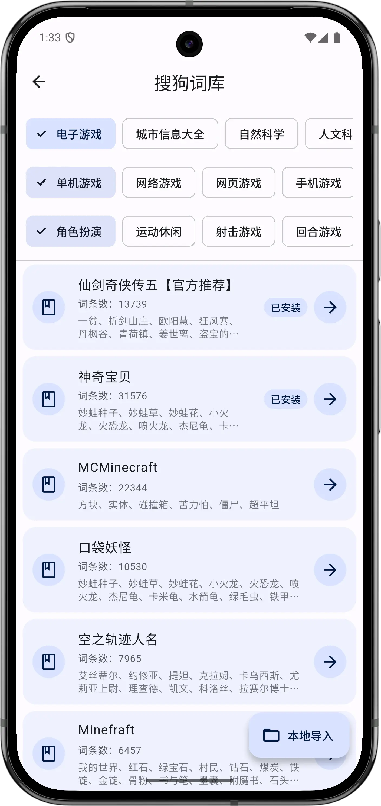
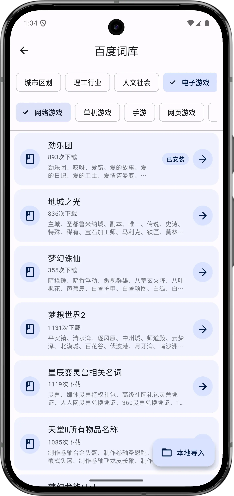
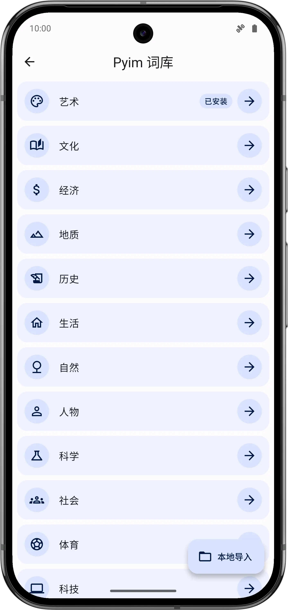
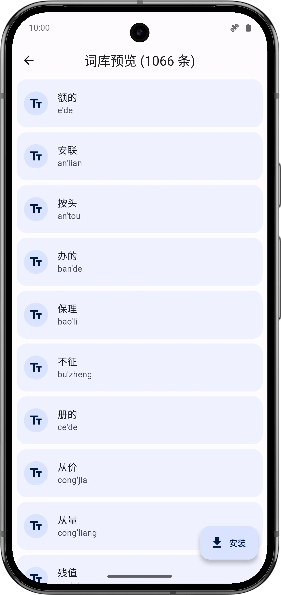
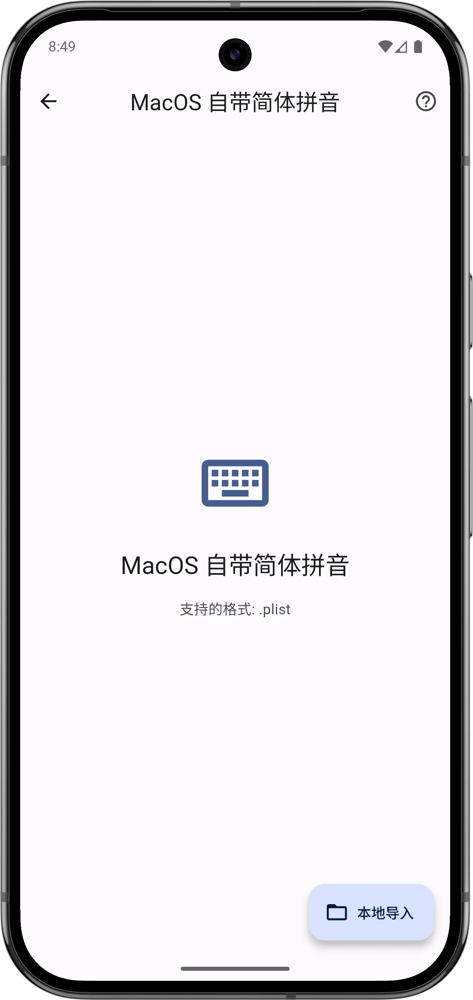
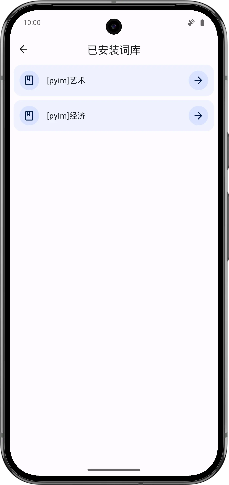
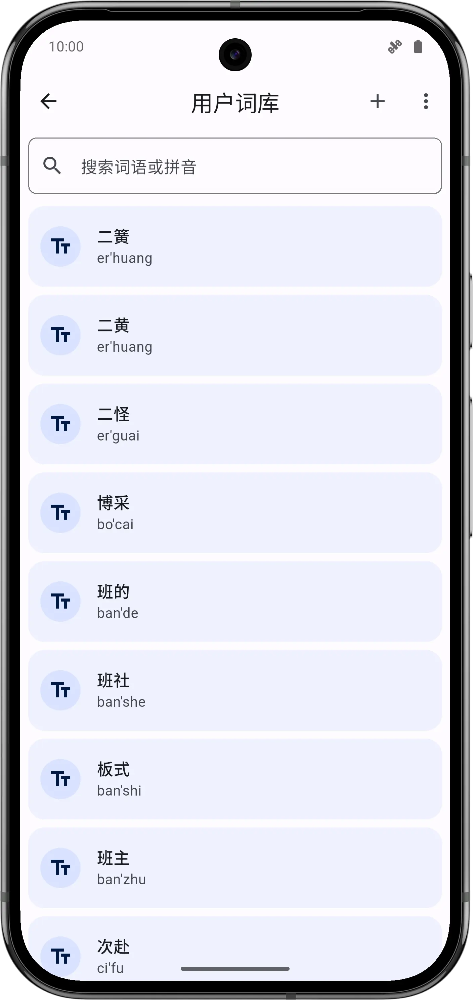
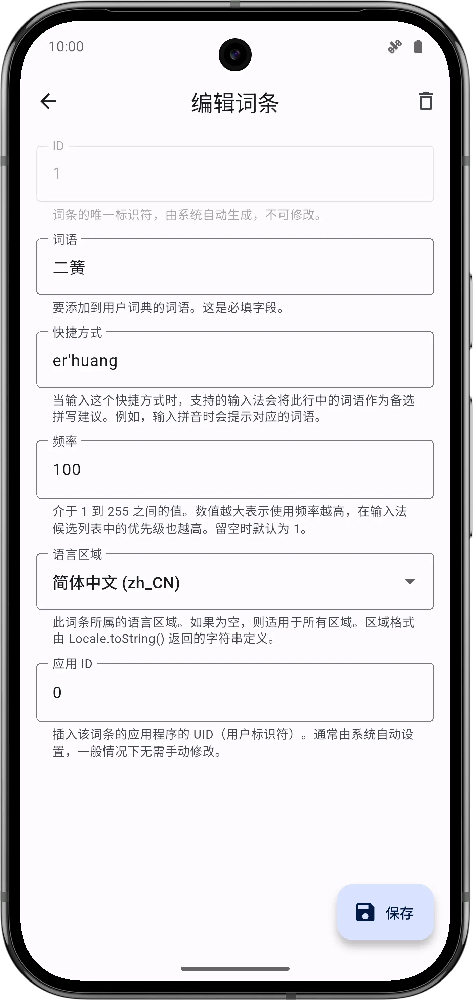
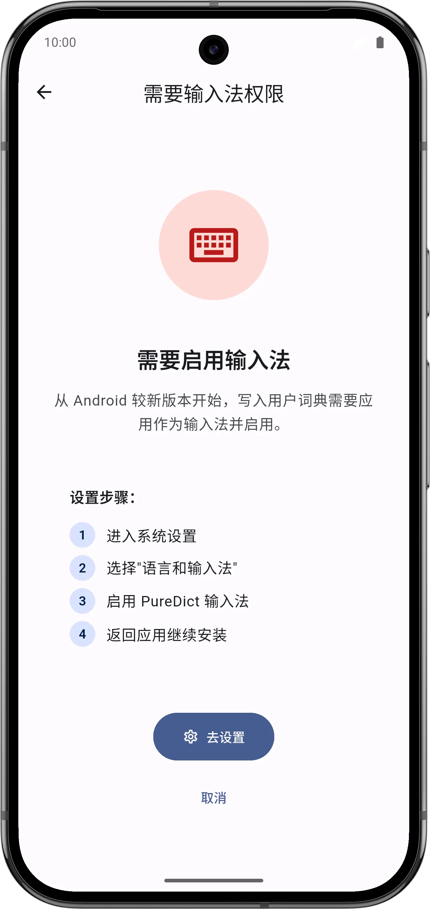

# PureDict

一个纯净、简洁的输入法词库导入工具，支持将多种主流输入法词库格式导入到 Android 系统用户词库中。

## 支持的输入法格式

### 拼音输入法
- 搜狗拼音 (.scel, .txt)
- QQ 拼音 (.qpyd, .txt)
- 百度拼音 (.bdict, .bcd, .txt)
- 谷歌拼音 (.txt)
- 微软拼音 (.dat, .txt)
- 必应拼音 (.txt)
- Rime (.txt)
- libpinyin (.txt)
- 紫光拼音 (.uwl, .txt)
- 手心输入法 (.txt)
- 新浪拼音 (.txt)
- 拼音加加 (.txt)
- Yahoo 奇摩 (.txt)
- macOS 原生 (.plist, .txt)
- Gboard (.zip)
- Emoji (.txt)

### 五笔输入法
- 搜狗五笔 (.scel)
- QQ 五笔 (.qcel)
- 极点五笔 (.txt)
- 小小输入法 (.txt)
- 小鸭五笔 (.txt)
- 五笔 86 (.txt)
- 五笔 98 (.txt)
- 五笔新世纪 (.txt)
- 极点郑码 (.txt)

### 其他输入法
- 仓颉输入法 (.txt)
- FIT 输入法 (.txt)
- 自定义格式 (.txt)

## 应用截图

<p float="center">











</p>

## 技术栈

- **框架**: Flutter 3.11+
- **状态管理**: Riverpod + Hooks
- **主题**: Dynamic Color (Material You)
- **文件处理**: file_picker, path_provider
- **编码支持**: gbk_codec
- **权限管理**: permission_handler
- **网络请求**: http
- **数据持久化**: shared_preferences

## 快速开始

```bash
flutter pub get 
dart run build_runner build --delete-conflicting-outputs 
dart run pigeon --input pigeons/dictionary_api.dart
flutter build apk --release
```

## 致谢

- [imewlconverter](https://github.com/studyzy/imewlconverter)
- [archive](https://pub.dev/packages/archive)
- [gbk_codec](https://pub.dev/packages/gbk_codec)
- [pigeon](https://pub.dev/packages/pigeon)

## 许可证

本项目遵循 [GPL-3.0 License](LICENSE)。
